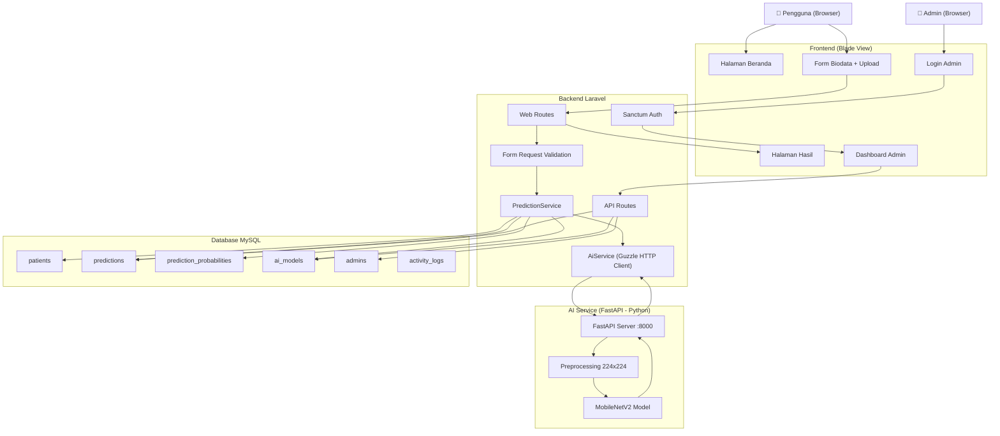
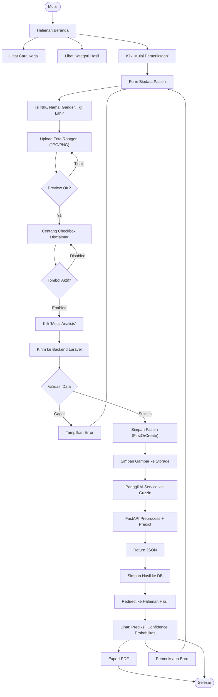
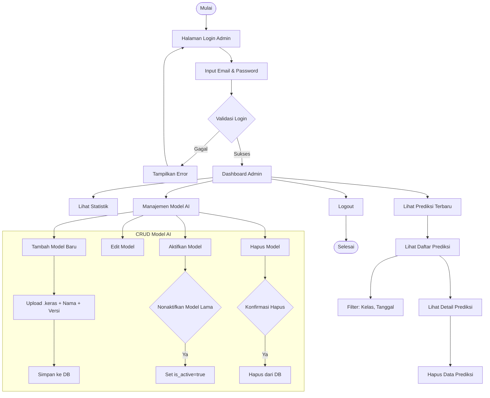
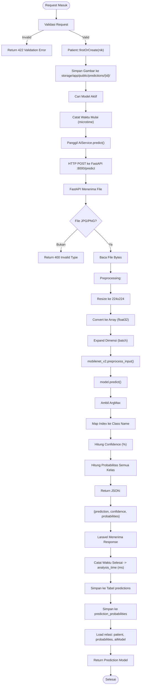

# Flowchart — Sistem Klasifikasi Citra Medis AI

---

## 1. Flowchart Sistem (Arsitektur)

---

## 2. Flowchart User

---

## 3. Flowchart Admin

---

## 4. Flowchart Prediksi AI

---

© 2026 — Proyek Akademik Sistem Klasifikasi Citra Medis AI
